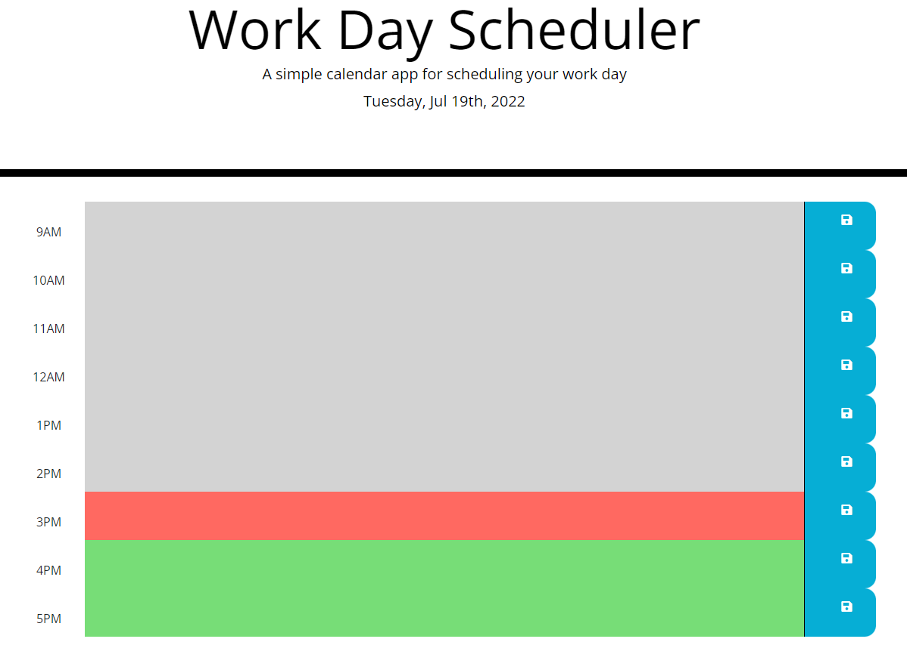

# 05 Third-Party APIs: Work Day Scheduler


## User Story

```md
AS AN employee with a busy schedule
I WANT to add important events to a daily planner
SO THAT I can manage my time effectively
```

## Acceptance Criteria

```md
GIVEN I am using a daily planner to create a schedule
WHEN I open the planner
THEN the current day is displayed at the top of the calendar
WHEN I scroll down
THEN I am presented with timeblocks for standard business hours
WHEN I view the timeblocks for that day
THEN each timeblock is color coded to indicate whether it is in the past, present, or future
WHEN I click into a timeblock
THEN I can enter an event
WHEN I click the save button for that timeblock
THEN the text for that event is saved in local storage
WHEN I refresh the page
THEN the saved events persist
```

## What I've Done

```
Added correct classes and bootstrap styles to html
Top of calendar now displays time, pulled from Moment
Added timeblocks for business hours
Added script to check ids of the time table to apply correct css depending on past (grey), present(red) or future (green)
Timeblocks are editable
Button saves timeblock event to local storage
Refreshing page the events persist
```

## Screenshot



## Live Link


